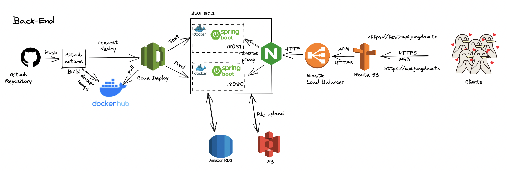
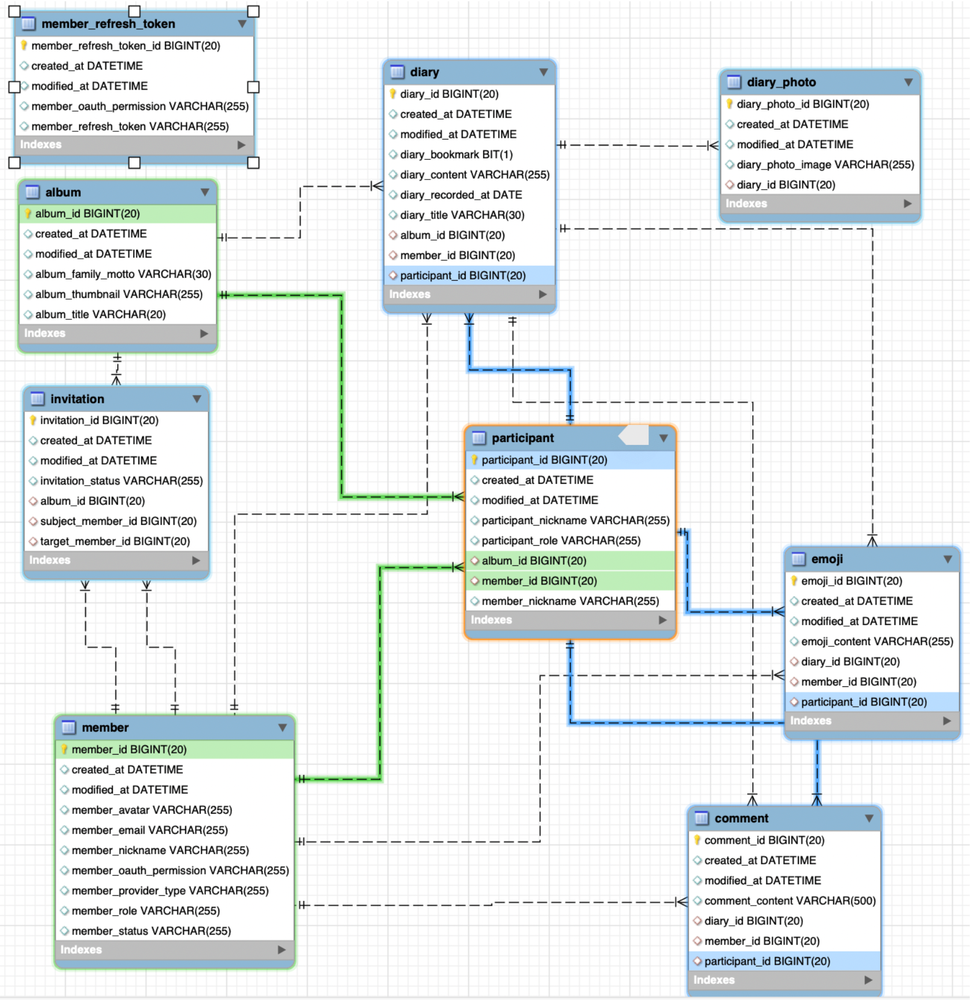

# 🎞 Jung Dam - Back End 🎞

## 🎞 프로젝트 소개

```
정(情)을 기록하고 담(情)을 나누며 추억에 빠져보세요.
우리 가족만의 앨범을 만들어서 공유 일기를 작성해보세요.

'정담'은 가족 간의 대화가 사라지는 지금, 우리에게 필요한 것이 무엇인지 고민했습니다.
정담은 오늘의 삶, 어제의 삶, 우리 가족의 삶을 공유 할 수 있습니다.
```

---

## 🧑‍💻 팀원 소개

### Back End Developer 🙋

|                                     구피                                      |                                     주디                                      |                                     데비                                      |
| :---------------------------------------------------------------------------: | :---------------------------------------------------------------------------: | :---------------------------------------------------------------------------: |
|  |  |  |
|                   [김동건](https://github.com/DongGeon0908)                   |                     [조수연](https://github.com/soo5717)                      |                     [황일용](https://github.com/dlfdyd96)                     |

---

## 💻 기술 스택

### Spring

- Java 11.X (lts)
- Gradle 7.2 (lts)
- SpringBoot 2.5.X
- Spring-data-jpa
    - entity-Graph
    - Facade Layer
- Spring-Security
    - OAuth2.0
    - JWT
- Swagger

### Database

- Mysql 5.7 lts (server)
- Mysql 8 (local)

### DevOps

- Git Submodule (secert config 관리)
- Github actions (java with gradle)
- AWS EC2, S3, RDS, Route53, ELB(L7), Certificate Manager, Code Deploy
- Docker, docker-compose
- NGINX

### 협업 관리

- 이슈 관리: Github Issue, Notion
- 문서화: Notion
- 커뮤니케이션: Slack, Discord

---

## 🏗 Diagram

### Architecture



### ERD


